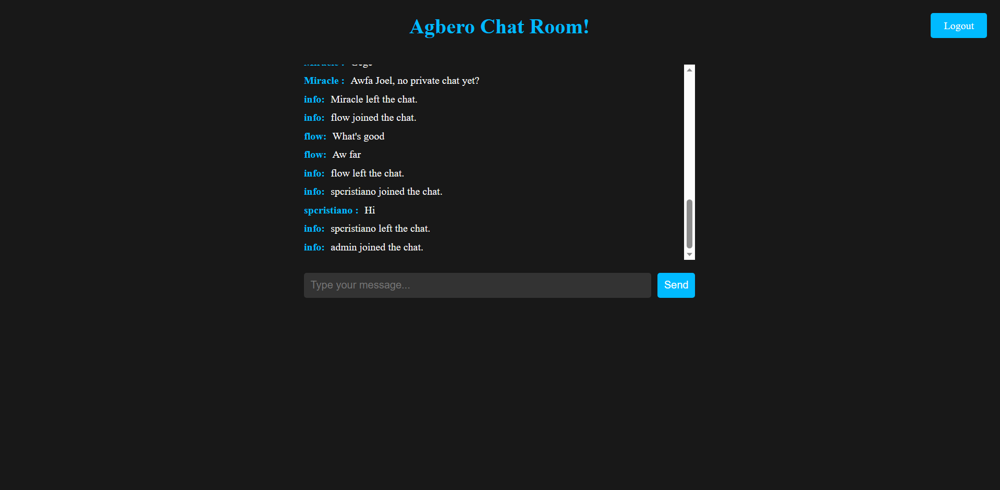

<a name="readme-top"></a>


<!-- PROJECT SHIELDS -->
<!--
*** I'm using markdown "reference style" links for readability.
*** Reference links are enclosed in brackets [ ] instead of parentheses ( ).
*** See the bottom of this document for the declaration of the reference variables
*** for contributors-url, forks-url, etc. This is an optional, concise syntax you may use.
*** https://www.markdownguide.org/basic-syntax/#reference-style-links
-->
[![Contributors][contributors-shield]][contributors-url]
[![Forks][forks-shield]][forks-url]
[![Stargazers][stars-shield]][stars-url]
[![Issues][issues-shield]][issues-url]
[![MIT License][license-shield]][license-url]
[![LinkedIn][linkedin-shield]][linkedin-url]


<!-- PROJECT LOGO -->
<br />
<div align="center">
  <a href="https://github.com/AnozieChibuike/WebChatO">
    
  </a>

<h3 align="center">WebChatIO</h3>

  <p align="center">
    Welcome to the Flask SocketIO Chat App! This project is designed to provide a real-time chatting experience with anyone. With the power of Flask and SocketIO, you can engage in seamless conversations with friends, family, or even strangers.
    <br />
    <a href="https://github.com/AnozieChibuike/WebChatO"><strong>Explore the docs »</strong></a>
    <br />
    <br />
    <a href="https://webchatv1.onrender.com/">View Demo</a>
    ·
    <a href="https://github.com/AnozieChibuike/WebChatO/issues">Report Bug</a>
    ·
    <a href="https://github.com/AnozieChibuike/WebChatO/issues">Request Feature</a>
  </p>
</div>


<!-- TABLE OF CONTENTS -->
<details>
  <summary>Table of Contents</summary>
  <ol>
    <li>
      <a href="#about-the-project">About The Project</a>
      <ul>
        <li><a href="#built-with">Built With</a></li>
      </ul>
    </li>
    <li>
      <a href="#getting-started">Getting Started</a>
      <ul>
        <li><a href="#prerequisites">Prerequisites</a></li>
        <li><a href="#installation">Installation</a></li>
      </ul>
    </li>
    <li><a href="#roadmap">Roadmap</a></li>
    <li><a href="#contributing">Contributing</a></li>
    <li><a href="#contact">Contact</a></li>
    <li><a href="#acknowledgments">Acknowledgments</a></li>
  </ol>
</details>


<!-- ABOUT THE PROJECT -->
## About The Project

[](https://postimg.cc/NKXwyNDF)
<p align="right">(<a href="#readme-top">back to top</a>)</p>


### Built With

* [![Flask][Flask]][Flask-url]
* [![socketIO][socket]][socket-url]
* [![Jinja][Jinja]][Jinja]
* [![MYSQL][MYSQL]][MYSQL]
* [![JS][JS]][JS]
* [![PYTHON][PYTHON]][PYTHON]
* [![HTML][HTML]][HTML]
* [![CSS][CSS]][CSS]
* [![render][render]][render]

<p align="right">(<a href="#readme-top">back to top</a>)</p>


<!-- GETTING STARTED -->
## Getting Started

To get a local copy up and running follow these simple example steps.

### Prerequisites

There are no requirements.txt file, so you hard-install...
* dependencies
  ```sh
  pip install flask flask-socketio flask-migrate flask-mysqldb flask-loginpython-dotenv
  ```

### Installation

1. Get a free MYSQL database at [https://www.freesqldatabase.com/](https://www.freesqldatabase.com/)
2. Clone the repo :
   ```sh
   git clone https://github.com/github_username/WebChatO.git
   ```
3. Set Environmental Variables :
   ```sh
   export dbName=<Database name>
   export password=<Database password>
   export username=<Database username>
   export host=<Database host>
   export SECRET=<A secret word>
   ```
   Note: Replace each value with your own
   
5. Edit the `.flaskenv` to your likening

6. Start the server: 
   ```sh
   flask run
   ```

<p align="right">(<a href="#readme-top">back to top</a>)</p>


_For more examples, please refer to the [Documentation](https://github.com/AnozieChibuike/webChatO)_

<p align="right">(<a href="#readme-top">back to top</a>)</p>


<!-- ROADMAP -->
## Roadmap

- [ ] File Sharing
- [ ] Profile Page
- [ ] Dynamic Nature
    - [ ] Create and Join Room
    - [ ] Video Calls
    - [ ] Private Dms

See the [open issues](https://github.com/AnozieChibuike/WebChatO/issues) for a full list of proposed features (and known issues).

<p align="right">(<a href="#readme-top">back to top</a>)</p>


<!-- CONTRIBUTING -->
## Contributing

Contributions are what make the open source community such an amazing place to learn, inspire, and create. Any contributions you make are **greatly appreciated**.

If you have a suggestion that would make this better, please fork the repo and create a pull request. You can also simply open an issue with the tag "enhancement".
Don't forget to give the project a star! Thanks again!

1. Fork the Project
2. Create your Feature Branch (`git checkout -b feature/AmazingFeature`)
3. Commit your Changes (`git commit -m 'Add some AmazingFeature'`)
4. Push to the Branch (`git push origin feature/AmazingFeature`)
5. Open a Pull Request

<p align="right">(<a href="#readme-top">back to top</a>)</p>


<!-- CONTACT -->
## Contact

Agbero From PhilaDEVia - [@JoelBlvck2](https://twitter.com/JoelBlvck2) - chibuikeanozie0@gmail.com

Project Link: [https://webchatv1.onrender.com/](https://webchatv1.onrender.com/)

<p align="right">(<a href="#readme-top">back to top</a>)</p>


<!-- ACKNOWLEDGMENTS -->
## Acknowledgments

* [Miguel Grinberg](https://blog.miguelgrinberg.com/)
* [ChatGPT](https://chat.openai.com/)
* [@othneildrew](https://github.com/othneildrew)

<p align="right">(<a href="#readme-top">back to top</a>)</p>


<!-- MARKDOWN LINKS & IMAGES -->
<!-- https://www.markdownguide.org/basic-syntax/#reference-style-links -->
[contributors-shield]: https://img.shields.io/github/contributors/AnozieChibuike/WebChatO.svg?style=for-the-badge
[contributors-url]: https://github.com/AnozieChibuike/WebChatO/graphs/contributors
[forks-shield]: https://img.shields.io/github/forks/AnozieChibuike/WebChatO.svg?style=for-the-badge
[forks-url]: https://github.com/AnozieChibuike/WebChatO/network/members
[stars-shield]: https://img.shields.io/github/stars/AnozieChibuike/WebChatO.svg?style=for-the-badge
[stars-url]: https://github.com/AnozieChibuike/WebChatO/stargazers
[issues-shield]: https://img.shields.io/github/issues/AnozieChibuike/WebChatO.svg?style=for-the-badge
[issues-url]: https://github.com/AnozieChibuike/WebChatO/issues
[license-shield]: https://img.shields.io/github/license/AnozieChibuike/WebChatO.svg?style=for-the-badge
[license-url]: https://github.com/AnozieChibuike/WebChatO/blob/master/LICENSE.txt
[linkedin-shield]: https://img.shields.io/badge/-LinkedIn-black.svg?style=for-the-badge&logo=linkedin&colorB=555
[linkedin-url]: https://linkedin.com/in/anoziejoel
[product-screenshot]: https://i.ibb.co/8dTgGnK/Screenshot-2023-07-11-033954.png
[Flask]: https://img.shields.io/badge/Flask-000000?style=for-the-badge&logo=flask&logoColor=white
[Flask-url]: https://flask.palletsprojects.com/en/2.3.x/
[socket]: https://img.shields.io/badge/Socket.io-black?style=for-the-badge&logo=socket.io&badgeColor=010101
[socket-url]: https://socket.io/
[Jinja]: https://img.shields.io/badge/Jinja-000000?style=for-the-badge&logo=jinja&logoColor=red
[Jinja]: https://jinja.palletsprojects.com/en/3.1.x/
[MYSQL]: https://img.shields.io/badge/MySQL-00000F?style=for-the-badge&logo=mysql&logoColor=white
[MYSQL]: https://angular.io/
[JS]: https://img.shields.io/badge/JavaScript%20-%23F7DF1E.svg?style=for-the-badge&logo=javascript&logoColor=white
[JS]: https://svelte.dev/
[PYTHON]: https://img.shields.io/badge/Python%20-%2314354C.svg?style=for-the-badge&logo=python&logoColor=white
[PYTHON]: https://laravel.com
[HTML]: https://img.shields.io/badge/Html5-563D7C?style=for-the-badge&logo=html5&logoColor=white
[HTML]: https://getbootstrap.com
[CSS]: https://img.shields.io/badge/Css3-0769AD?style=for-the-badge&logo=css3&logoColor=white
[CSS]: https://jquery.com 
[render]: https://img.shields.io/badge/Render-0769AD?style=for-the-badge&logo=render&logoColor=white
[render]: https://jquery.com 
